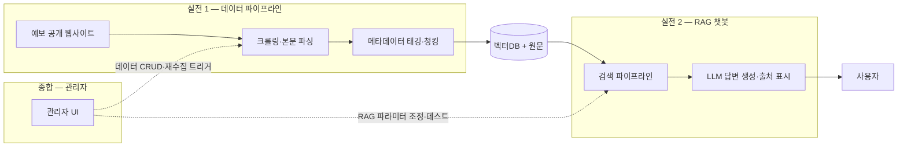

<div align="center">

# 4MATION

**LikeLion AI/NLP 5기 · 클라비 기업 연계 프로젝트**

예금보험공사(KDIC) 데이터 관리체계 고도화 및 생성형 AI 서비스 구축

</div>

---

## 📌 프로젝트 소개

예금보험공사 공개 웹사이트(kdic.or.kr, fins.kdic.or.kr)에 산재한 데이터를 **중앙화**하고, 기존 Rule 기반 챗봇을 **RAG 기반 자연어 AI 챗봇**으로 개편하는 PoC 프로젝트.

- **문제**: 웹사이트 데이터가 산재해 있고, 기존 대외 챗봇은 Rule 기반이라 자연어 질의 대응 불가
- **목표**: 데이터 통합 관리 체계 + 6개 업무 질의에 답하는 RAG 챗봇 + 운영 모니터링 대시보드
- **성격**: 기술 타당성 검증(PoC) → 향후 사업화 기반 마련

## 🧩 프로젝트 구성 (3단계)

| 단계 | 이름 | 내용 | 상태 |
|------|------|------|------|
| 실전 1 | **데이터 파이프라인** | 크롤링 → 본문 파싱 → 메타데이터 태깅 → 청킹 → 벡터DB 적재 | ✅ v0 완료 — [`crawler/`](./crawler/) |
| 실전 2 | **RAG 챗봇** | 6개 업무 질의응답, 출처 표시, 민원 처리 안내 | 진행 예정 |
| 종합 | **관리자 기능** | 데이터 CRUD·재수집 트리거, RAG 파라미터(Top-K, Chunk Size) 테스트 UI | 예정 |

## 🏗 서비스 아키텍처



## 📦 기대 산출물

1. 6개 업무 검색 범위 정의서 + 수집 코퍼스 (계층 메타데이터 포함)
2. RAG 자연어 챗봇 (출처 표시·민원 처리 안내)
3. 관리자 트리거 기반 수집·전처리·적재 파이프라인
4. RAG 파라미터 테스트 관리자 UI
5. 평가 테스트셋 + 성능 평가 리포트

## 👥 팀원

| 이름 | 역할 | GitHub |
|------|------|--------|
| 김경은 | 팀장 / TBD | [@Gyeong-Eun](https://github.com/Gyeong-Eun) |
| 박유상 | TBD | [@us788](https://github.com/us788) |
| 양현욱 | TBD | [@ukkhnn](https://github.com/ukkhnn) |
| 문규남 | TBD | [@mungn0603-code](https://github.com/mungn0603-code) |

## 🛠 기술 스택

| 분류 | 실전 1 확정 (v0) | 이후 단계 후보 |
|------|------|------|
| Language | Python 3.11+ | — |
| 수집/전처리 | requests · BeautifulSoup(lxml) — 규칙 기반, LLM 미사용 | Playwright (동적 페이지 필요 시) |
| 임베딩 | `jhgan/ko-sroberta-multitask` (로컬, 768d) | CLOVA 임베딩 (프로덕션) |
| 검색 | FAISS + BM25(kiwipiepy) 하이브리드, RRF 융합 — 직접 구현 | Reranking (cross-encoder / CLOVA) |
| LLM | — | **CLOVA Studio 우선** (실전 2) |
| UI | — | Streamlit (데모) → React (관리자) |
| Backend | — | FastAPI |
| Infra / 협업 | GitHub, Notion, Discord | — |

## 📂 프로젝트 구조

```text
4MATION/
├── crawler/        # 실전 1: 데이터 파이프라인 (수집→파싱→청킹→인덱스→평가)
│   ├── README.md   #   실행 순서·산출물 안내
│   ├── DECISIONS.md · HOLES.md   # 판단 로그 · 이슈/팀 이관
│   └── data/       #   chunks.jsonl · testset.jsonl · eval_report.md (커밋분)
├── docs/           # 기획·회의록·발표자료
├── 산출물_D1.md     # D1 산출물 총람
└── CONTRIBUTING.md # 협업 규칙

(예정) chatbot/ — 실전 2 RAG 챗봇 · admin/ — 종합 관리자 대시보드
```

## 🚀 실행 방법

실전 1 데이터 파이프라인 (상세: [`crawler/README.md`](./crawler/README.md)):

```bash
git clone https://github.com/likelion-4MATION/4MATION.git
cd 4MATION/crawler
pip install -r requirements.txt
python pipeline.py --rebuild   # 수집→파싱→청킹→임베딩→인덱스 원커맨드
python eval.py                 # 검색 평가 리포트
```

## 🤝 협업 규칙

브랜치 전략, 커밋 컨벤션, PR 규칙은 [CONTRIBUTING.md](./CONTRIBUTING.md) 참고.

## 📅 프로젝트 기간

`2026.07.10 ~ 2026.09.02`
